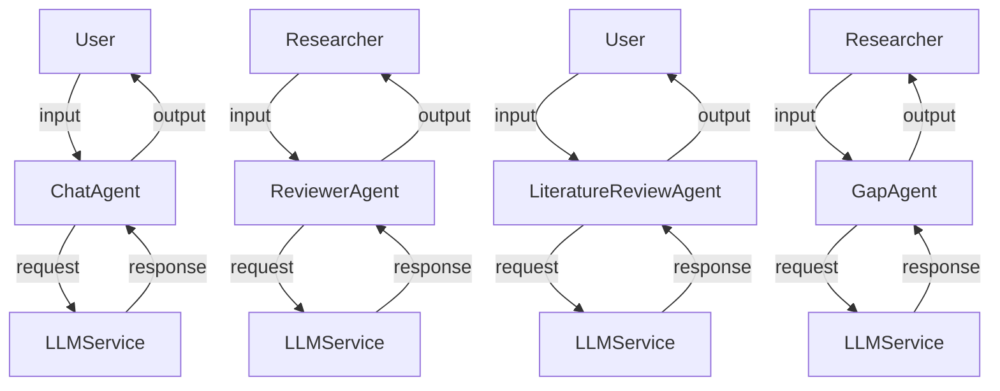

# Project Overview
The PaperMind project is an AI-powered research assistant that helps users in generating research papers, conducting literature reviews, and identifying gaps in existing research. It uses various machine learning models and natural language processing techniques to provide insights and suggestions to the users.

# Key Features
* Research paper generation
* Literature review
* Gap analysis
* Chat interface for user interaction
* User-friendly dashboard for project management

# Architecture
The project follows a microservices architecture, with separate modules for each feature. The main components include:
* `app/main.py`: The entry point of the application, responsible for setting up the API routes and database connections.
* `app/agents`: A collection of agents that perform specific tasks, such as chat, reviewer, literature review, and gap analysis.
* `app/services`: A collection of services that provide functionality for the agents, such as LLM service, retrieval service, and embedding service.
* `app/repositories`: A collection of repositories that handle data storage and retrieval.

# Project Structure
The project is organized into the following directories:
* `app`: The main application directory, containing the entry point, agents, services, and repositories.
* `backend`: The backend directory, containing the API routes, database connections, and other backend-related code.
* `frontend`: The frontend directory, containing the user interface code.

# Tech Stack
The project uses the following technologies:
* Python as the programming language
* FastAPI as the web framework
* SQLAlchemy as the ORM
* Pydantic as the data validation library
* LitELM as the language model

# Main Components
The main components of the project are:
* `ChatAgent`: Responsible for handling user interactions and generating responses.
* `ReviewerAgent`: Responsible for reviewing research papers and providing feedback.
* `LiteratureReviewAgent`: Responsible for generating literature reviews.
* `GapAgent`: Responsible for identifying gaps in existing research.

# Installation
To install the project, run the following commands:
* `pip install -r requirements.txt`
* `python app/main.py`

# Configuration
The project uses environment variables for configuration. The following variables are required:
* `DB_HOST`: The database host
* `DB_PORT`: The database port
* `DB_USERNAME`: The database username
* `DB_PASSWORD`: The database password

# Usage
To use the project, simply run the application and access the API endpoints. The API documentation is available at `/api/v1/docs`.

# Architecture Overview
The PaperMind project follows a microservices architecture, with separate modules for each feature. The main components include:
* `app/main.py`: The entry point of the application, responsible for setting up the API routes and database connections.
* `app/agents`: A collection of agents that perform specific tasks, such as chat, reviewer, literature review, and gap analysis.
* `app/services`: A collection of services that provide functionality for the agents, such as LLM service, retrieval service, and embedding service.
* `app/repositories`: A collection of repositories that handle data storage and retrieval.

# High-Level Design
The high-level design of the project involves the following components:
* User interface: The user interface is responsible for handling user input and displaying the output.
* Agents: The agents are responsible for performing specific tasks, such as chat, reviewer, literature review, and gap analysis.
* Services: The services provide functionality for the agents, such as LLM service, retrieval service, and embedding service.
* Repositories: The repositories handle data storage and retrieval.

# Project Structure
The project is organized into the following directories:
* `app`: The main application directory, containing the entry point, agents, services, and repositories.
* `backend`: The backend directory, containing the API routes, database connections, and other backend-related code.
* `frontend`: The frontend directory, containing the user interface code.

# Execution Flow
The execution flow of the project involves the following steps:
1. The user interacts with the user interface, providing input and receiving output.
2. The user interface sends the input to the corresponding agent.
3. The agent processes the input and sends a request to the corresponding service.
4. The service processes the request and sends a response to the agent.
5. The agent receives the response and sends the output to the user interface.

# Data Flow
The data flow of the project involves the following steps:
1. The user provides input to the user interface.
2. The user interface sends the input to the corresponding agent.
3. The agent processes the input and sends a request to the corresponding service.
4. The service processes the request and retrieves data from the repository.
5. The service sends the data to the agent.
6. The agent receives the data and sends the output to the user interface.

# Module Relationships
The modules of the project are related in the following way:
* The user interface interacts with the agents.
* The agents interact with the services.
* The services interact with the repositories.

# AI/ML Components
The project uses the following AI/ML components:
* LLM service: The LLM service provides language model functionality for the agents.
* Retrieval service: The retrieval service provides data retrieval functionality for the agents.
* Embedding service: The embedding service provides data embedding functionality for the agents.

# Storage and Data Layer
The project uses the following storage and data layer components:
* Database: The database stores the data for the project.
* Repository: The repository handles data storage and retrieval.

# External Services
The project uses the following external services:
* Language model: The language model provides language model functionality for the project.
